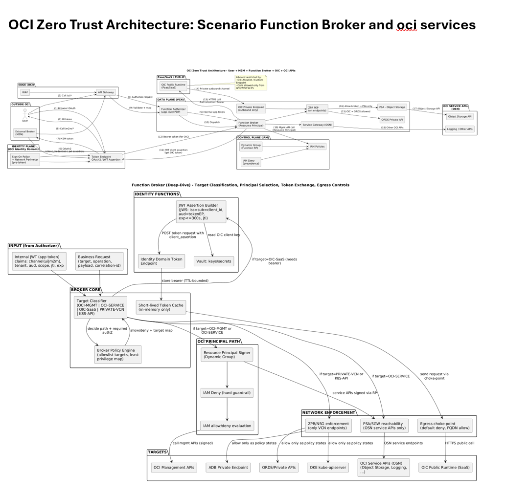
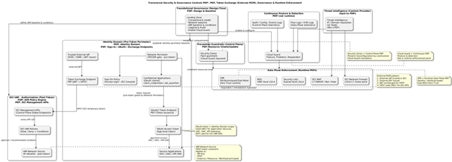
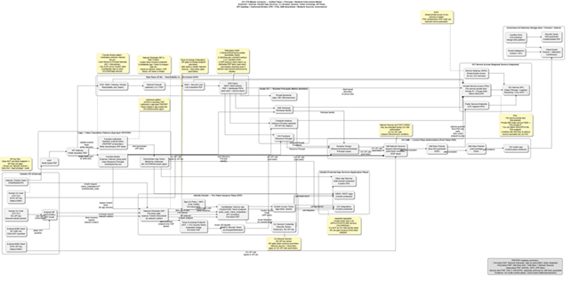

# # OCI Zero Trust Architecture – Multi-Perimeter Model and Intent-Based Access Control

Enterprise Oracle Cloud Infrastructure (OCI) Zero Trust Architecture reference model based on a multi-plane, multi-perimeter enforcement design.

---

## Objective

This repository formalizes a coherent Zero Trust Architecture (ZTA) model for OCI, aligning identity, authorization, governance, and runtime enforcement according to NIST SP 800-207 principles.

The goal is to provide an architectural interpretation that clearly separates:

- Pre-token controls (Identity Domain level)
- Post-token authorization (OCI IAM control plane)
- Data plane runtime enforcement (ZPR, NSG, WAF, Network Firewall)
- Preventive governance (Landing Zones, Security Zones)
- Continuous monitoring and evidence (Cloud Guard, Audit, Logs)

---

## Architectural Principles

• Explicit separation between Policy Decision Point (PDP) and Policy Enforcement Point (PEP)

• Clear distinction between:
  - Network Perimeter (pre-token, Identity Domain)
  - Network Sources (post-token, IAM policy conditions)

• Intent-based data plane enforcement through Zero Trust Packet Routing (ZPR)

• Deny-first governance model using IAM Deny Policies

• Security-by-construction through Landing Zones and Security Zones

• Runtime enforcement independent from network topology (identity-centric model)

---

## Core Components Covered

- OCI IAM (Allow / Deny / Conditions)
- Network Sources
- Network Perimeters (Identity Domain)
- Zero Trust Packet Routing (ZPR)
- Network Security Groups (NSG) & Security Lists
- OCI Network Firewall
- OCI Web Application Firewall (WAF)
- Landing Zones
- Security Zones
- Cloud Guard
- Audit & Flow Logs
- Private Service Access (PSA)

---

## Key Conceptual Contributions

- Formal PDP / PEP decomposition across Control Plane and Data Plane
- Multi-perimeter Zero Trust interpretation instead of single-layer model
- Pre-token vs Post-token security distinction
- ZPR positioned as runtime ABAC enforcement layer
- Prescriptive matrix mapping scenarios → mandatory security control chain

---

## Repository Structure

/docs  
  OCI-Zero Trust Architecture-Multi-Perimeter Model and Intent-Based Access Control.pdf  

/diagrams  
  ZTA diagrams and architectural views  

---

## 📄 Download

[Full PDF Document](./docs/OCI Zero Trust Architecture-Multi-Perimeter Model and-Intent-Based Access Control.pdf)

---

## References

This work is based on publicly available documentation including:

- NIST SP 800-207 (Zero Trust Architecture)
- Oracle Cloud Infrastructure Security Documentation
- Enterprise multi-plane security principles
- CISA Zero Trust Maturity Model

---

## Architecture Diagrams

### 1. Function Broker and OCI Services

### 2. Token Exchange and OCI Services

### 3. Inbound and Outbound OCI Process Scenarios

---

## Scope

This is an independent architectural work intended for educational and professional contribution purposes.

It does not represent official Oracle documentation.
